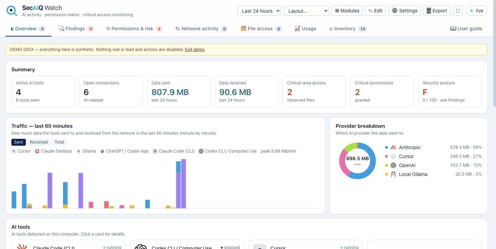
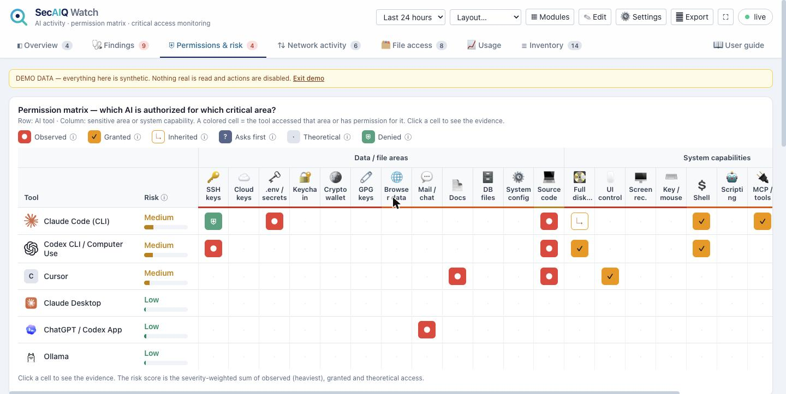

# SecAIQ Watch

**See what the AI tools on your computer are doing.** SecAIQ Watch detects AI assistants, coding agents, local models and
MCP servers on your machine and shows where they connect, how much data they send, what they are allowed to reach, what
they have touched, and how many tokens they use — in a local dashboard. It is **read-only**: it never blocks traffic and
never sees prompts, responses or file contents.

> Local · read-only · no cloud · no account · PHP + SQLite · macOS, Linux, Windows

> **Beta (v0.9.0-beta).** It works well on macOS; Linux and Windows support has only been tested against sample command output.
> If something misbehaves, run `php bin/diagnostics.php` and [open an issue](https://github.com/Spaksu/secaiq-watch/issues) with the output.
> See [`CHANGELOG.md`](CHANGELOG.md) for known limitations.




<sub>Screenshots use the built-in demo mode (synthetic data).</sub>

## What you get

| | |
|---|---|
| **Detection** | ~37 tools (Claude, Codex, Cursor, Windsurf, Copilot, Gemini, Ollama, LM Studio, Aider, OpenCode, Zed, Kiro, Warp, Goose, MCP servers, agent frameworks…) and ~33 provider domains |
| **Network** | Live connections, destinations, bytes sent/received per tool, upload spike and baseline-anomaly alerts |
| **Permissions & risk** | Which tool can reach which sensitive area (SSH keys, `.env`, cloud credentials, browser data, keychain…), with one-click *Protect* presets for Claude Code and per-permission "how to remove it" guides for macOS, Linux and Windows |
| **Findings** | Risky settings ranked critical → low: bypass modes, broad allow rules, MCP servers, hooks, hard-coded secrets, prompt-injection-style instruction files, AI browser extensions, posture score A–F |
| **File access** | Files and folders tools have open, classified by sensitivity |
| **Usage** | Token usage per day, model, project and tool (Claude Code, Codex) with cost estimates |
| **Reports** | HTML / Markdown report, **AI-BOM** (CycloneDX 1.5), CSV and JSON exports, hash-chained action log with undo |
| **Guide** | Full user guide built into the app (**User guide** tab), also in [`GUIDE.md`](GUIDE.md) |

## Platform support

| | macOS | Linux | Windows |
|---|---|---|---|
| Processes | ✅ | ✅ | ✅ |
| Connections + bytes | ✅ | ✅ TCP | ⚠️ connections only |
| Open files | ✅ | ✅ (your processes) | ❌ |
| System permission scan (TCC) | ✅ optional | – | – |

Linux and Windows support is newer and has been tested with sample command output only — issues and fixes are welcome.

## Quick start

Requires **PHP 8.1+** with `pdo_sqlite`. No Composer, no build step, no database server.

```bash
git clone https://github.com/Spaksu/secaiq-watch.git && cd secaiq-watch
php bin/collect.php &                          # collector
php -S 127.0.0.1:8099 -t . router.php          # panel
```
Open **http://127.0.0.1:8099/** (only `127.0.0.1` / `localhost` are accepted).

Run it as a background service that starts at login and can be restarted from **⚙ Settings**:

```bash
bin/install-agent.sh install          # macOS (LaunchAgents) and Linux (systemd user units)
```
```powershell
powershell -ExecutionPolicy Bypass -File bin\install-agent.ps1 install     # Windows (Task Scheduler)
```

Optional provider/app icons: `bin/icons.sh` (macOS) extracts app icons from your installed apps and downloads brand logos.
The UI works without them.

Try it with synthetic data: `php bin/seed-demo.php`, then open `http://127.0.0.1:8099/?demo=1`.

## Security in one paragraph

The panel accepts loopback connections with a local `Host` only (no DNS-rebinding), serves no data files, requires a secret
token + same-origin for every action, stores its database/token/queue owner-only, ships its own scripts (no CDN) under a strict
Content-Security-Policy, and escapes all observed text. Every change it makes to Claude Code / Codex settings is backed up,
logged and undoable. Details and honest limits: [`GUIDE.md`](GUIDE.md) → *Privacy & safety model*, [`SECURITY.md`](SECURITY.md).
Check a running install with `tests/security-check.sh`.

## Configuration

Everything is editable in **⚙ Settings**; the file is `config/settings.php` (see `config/settings.example.php`).
Tool and provider signatures live in `config/signatures.php`; the manual-removal texts in `config/howto.php`.

## Tests

```bash
php tests/platform-test.php     # parsers and signatures for macOS / Linux / Windows output
tests/security-check.sh         # probes the running panel
```

## License

[MIT](LICENSE) © SecAIQ. Third-party notices: [`NOTICE.md`](NOTICE.md). The SecAIQ name and logo are not covered by the code license.
